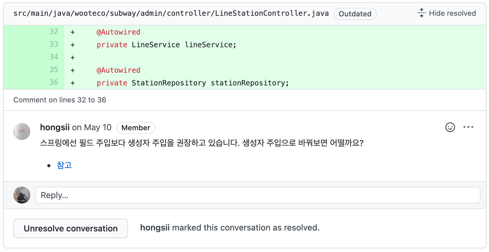

## Spring의 DI, 그리고 IoC

글의 본문을 들어가기 이전에 글에서 주로 언급하게 될 DI의 개념에 대해 짚어보고 가겠다.

**DI**는 *Dependency Injection*, 말 그대로 **의존성 주입**을 말한다. 이는 **객체 간의 의존성을 외부에서 주입하여 관리하겠다**라는 개념인데 아래의 예제를 통해서 DI에 대해 알아보자.

만약 지하철의 라인을 관리하기 위한 LineService가 존재하고, LineService에서는 DB에서 데이터를 가져오기 위해 LineRepository가 필요하다고 가정해보자.

```java
@Service
public class LineService {
    private final LineRepository repository;
    
    public LineService() {
        this.repository = new LineRepository();
    }
    
    ...

}
```

DI를 적용하기 이전에는 LineRepository를 사용하는 LineService에서 LineRepository를 생성하고 관리해야 한다.

위의 방법은 LineService와 LineRepository간의 의존성이 높다. 의존이 높다는 말은 **코드의 재사용성이 떨어지고 변경에 유연하지 못하며 테스트 코드를 작성하기 어려워진다.**

동일한 코드에 DI 개념을 적용해보면 어떻게 바뀔까?

```java
@Service
public class LineService {
    @Autowired
    private LineRepository repository;
    
    public LineService() {
    }
    
    ...

}
```

Spring에선 `@Autowired` 어노테이션을 통해 LineService의 의존 객체인 LineRepository를 주입받을 수 있다.

이렇게 외부에서부터 의존을 주입받으면 의존을 내부에서 정의하지 않기 때문에 객체 간의 의존성을 줄여주고 코드의 재사용성도 증가하며 변화에 민감하지 않을 수 있다.

외부에서 의존을 주입받는 방법은 기존에 마치 이전에 내부에서 의존을 관리하는 방법을 뒤바꾼듯한 모양이다. 이를 Spring에선 **IoC**(**Inversion of Control)**이라 하고 Spring의 주요 개념 중 하나이다.

<br/>

## Dependency Injection의 방법

Spring에서 의존성을 주입받는 방법은 크게 3가지가 존재한다.

### 1. Field Injection

가장 흔히 볼 수 있는 Injection 방법으로 사용하기도 간편하고 코드도 읽기 쉽다.

```java
@Service
public class LineService {
    @Autowired
    private LineRepository repository;
    
    public LineService() {
    }
}
```

### 2. Setter Injection

선택적인 의존성을 주입할 경우 유용하다.

```java
@Service
public class LineService {
    private LineRepository repository;
    
    public LineService() {
    }
    
    @Autowired
    public void setRepository(LineRepository lineRepository) {
        this.repository = lineRepository;
    }
}
```

### 3. Constructor Injection

별다른 어노테이션 없이 매개변수 생성자만 열어두면 사용 가능하다.

```java
@Service
public class LineService {
    private final LineRepository repository;
    
    public LineService(LineRepository repository) {
        this.repository = repository;
    }
}
```

DI의 방법은 위와 같이 세 가지 방법이 존재하지만, 그중 Field Injection을 가장 흔히 사용하고 있다.

그러나 이번 [atdd-subway-admin 미션](https://github.com/woowacourse/atdd-subway-admin)에서 이런 피드백이 존재하였다.



<br/>

## 그렇다면 왜 Constructor Injection을 써야 하는가?

기존에 가장 흔히 사용하는 Field Injection이 아니라 Constructor Injection을 써야 하는 이유는 무엇일까?

### 1. 단일 책임의 원칙

Field Injection은 의존성 주입이 너무 쉬우므로 무분별한 의존을 주입할 수도 있다. 그러면 하나의 클래스에서 지나치게 많은 기능을 하게 될 수 있는 여지가 있고, '객체는 그에 맞는 동작만 한다'라는 단일 책임의 원칙이 깨지기 쉽다.

Constructor Injection을 사용하면 의존을 주입해야 하는 대상이 많아질수록 생성자의 인자가 늘어나게 된다. 이는 의존관계의 복잡성을 쉽게 파악할 수 있도록 도와주므로 리팩토링의 실마리를 제공하게 된다.

### 2. DI Container와의 결합

Field Injection을 사용하면 해당 클래스를 곧바로 Instant화 시킬 수 없다. 만약 DI를 제공해주는 Container 밖의 환경에서 의존을 주입받는 클래스의 객체를 참조할 때, Dependency를 정의해두는 Reflection을 사용하는 방법 외에는 참조할 방법이 없다.

Constructor Injection은 생성자로 의존을 주입받기 때문에 DI Container에 의존하지 않고 사용할 수 있고, 그 덕분에 테스트에서도 더 용이함을 보인다.

### 3. Immutability

Field Injection은 객체를 생성하고 의존을 Reflection으로 주입받기 때문에 필드 변수를 Immutable로 선언할 수 없다.

그러나 Constructor Injection은 필드를 final로 선언할 수 있기 때문에 필드의 변경에 대해 안전하다. 이는 객체의 변경에 따른 비용을 절약할 수 있도록 도와준다.

### 4. 순환 의존성

Constructor Injection에서는 순환 의존성을 가질 경우 BeanCurrentlyInCreationException이 발생해서 순환 의존성을 알 수 있게 해준다.

이와 같은 이유로 Spring 4.x 이후부터는 Constructor Injection을 사용하기를 권장하고 있다.

<br/>

## 정리하면

사실 어떤 Framework를 사용하든지 그것은 도구에 불과하다.

도구를 사용하는 것보다는 객체 지향적인 설계와 구조로 코드를 작성하는 것에 집중해야지 유연하고 재사용하기 좋은 프로그램을 만들 수 있다.

Constructor Injection은 이러한 관점에서 충분히 장점을 가지는 DI 방식이다. DI를 보다 객체 지향적이고 유연하게 사용할 수 있도록 도와주기 때문에 나중에 의존성을 주입해야 하는 상황이 생겼을 때 해당 방법을 충분히 고민해보고 적용해보자.

그렇다면 더 나은 설계와 구조로 프로그램을 만드는 데 큰 도움이 될 수도 있을 것이다.

<br/>

## 참고 링크

> [DI(의존성 주입)가 필요한 이유와 Spring에서 Field Injection보다 Constructor Injection이 권장되는 이유 - Mimul](https://www.mimul.com/blog/di-constructor-injection/)
>
> [Spring DI(Dependency Injection)의 정의와 사용 - Jins' Dev Inside](https://jins-dev.tistory.com/entry/Spring-DIDependency-Injection-의-정의와-사용)

